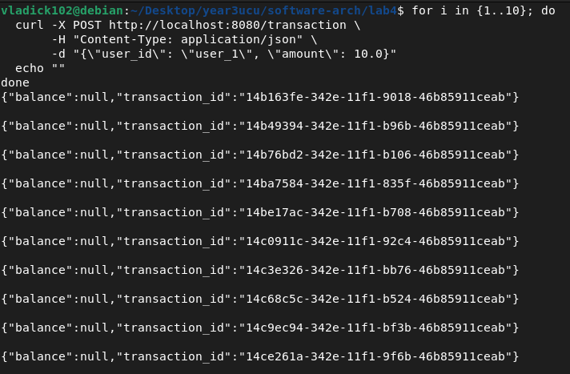
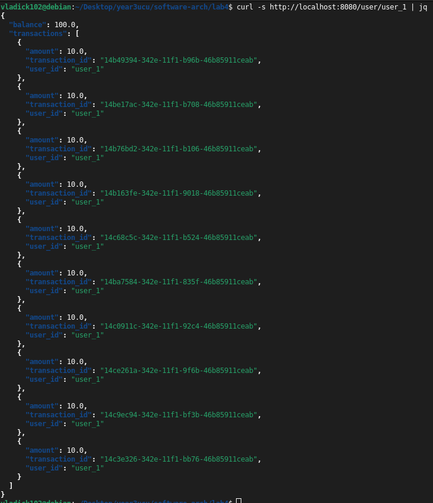
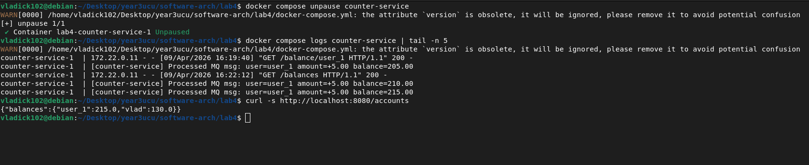

# Microservices with MessageQueue and Service Registry (Lab 4)

In this lab, we introduced asynchronous messaging for transaction processing to improve system resilience, and a dynamic Service Registry for discovering instances.

## Architecture

The updated system consists of the following components:

- **Config Server (Port 8083)** - A new Service Registry. All microservices automatically register their addresses exactly when they spin up.
- **Facade Service (Port 8080)** - Main entry point that dynamically discovers nodes via Config Server. Instead of blocking during POST requests, it now immediately pushes transactions into a Hazelcast Distributed Queue for asynchronous handling.
- **Logging Service (Port 8081)** - 3 instances running in parallel. Registers with Config Server upon startup and uses a Hazelcast In-Memory Distributed Map to properly sync logs across nodes.
- **Counter Service (Port 8082)** - Background worker setup. Includes a continuous background thread consuming transactions directly from the Hazelcast Distributed Queue (Producer-Consumer pattern), securely processing them sequentially and updating MongoDB.
- **Hazelcast Cluster** - 3 nodes providing the Distributed Queue and Map infrastructure.
- **MongoDB** - Disk-based persistent DB for the counter service.

All services are containerized and orchestrated with Docker Compose.

## Running the Application

Start all services:
```bash
docker compose up --build -d
```

Stop all services:
```bash
docker compose down
```

## Testing & Verification

### 1. Asynchronous Transactions (Message Queue)

Sending 10 independent transactions via `POST`. The Facade Service immediately returns success with `balance: null` and a valid `transaction_id`, successfully delegating the processing workload to the message queue.

```bash
for i in {1..10}; do
  curl -X POST http://localhost:8080/transaction \
       -H "Content-Type: application/json" \
       -d "{\"user_id\": \"user_1\", \"amount\": 10.0}"
  echo ""
done
```



### 2. Distributed Logging

We can verify that all logs were correctly parsed and accessed through our distributed load-balancing system by issuing a synchronous `GET` request.

```bash
curl -s http://localhost:8080/user/user_1 | jq
```



### 3. Fault Tolerance & Queue Persistence

To prove that no records are lost when the actual downstream processing service goes offline, we artificially freeze the Counter Service:

```bash
docker compose pause counter-service
```

We send `POST` traffic while it's offline. The Facade gracefully absorbs them safely via the Hazelcast Message Queue. However, synchronous endpoint queries correctly time out because the reader is paused:

```bash
curl -s http://localhost:8080/accounts
```


Upon unfreezing the Counter Service, the background thread instantly drains the accumulated messages from the Queue, sequentially restoring balances without dropping a single packet:

```bash
docker compose unpause counter-service
```

```bash
docker compose logs counter-service | tail -n 5
```

```bash
curl -s http://localhost:8080/accounts
```

