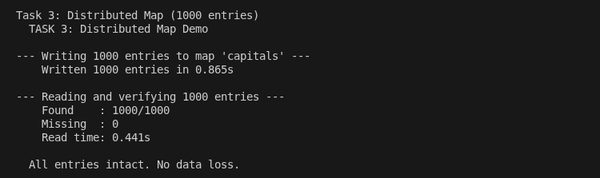
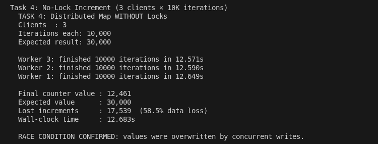
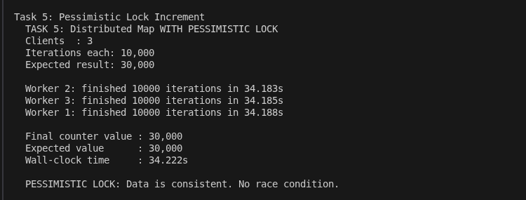
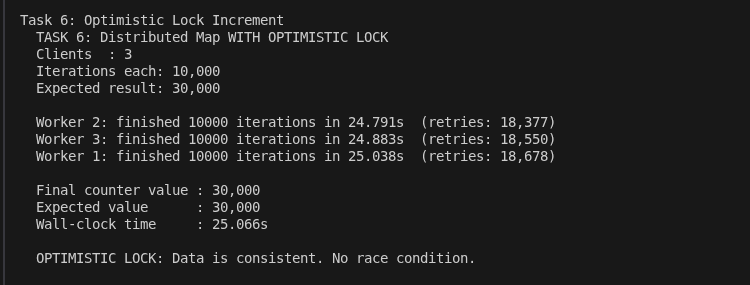
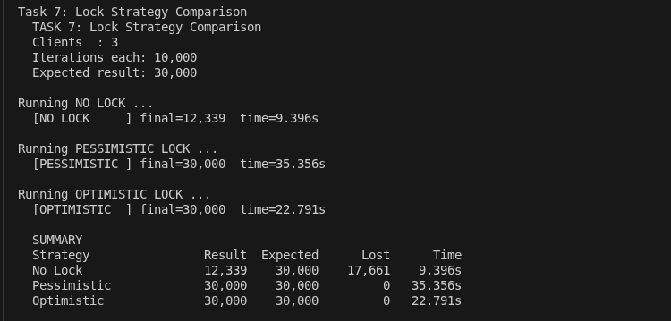

# Lab 2 - Hazelcast Distributed Data Structures

```bash
pip install -r requirements.txt

docker compose up -d

# Wait ~20 s for the cluster to form, then run any script
python src/task3_distributed_map.py
python src/task7_compare_locks.py
python src/task8_bounded_queue.py

# OR run everything at once
bash run_all.sh
```

**HazelCast Management Center** - http://localhost:8080

---

## Task descriptions

### Task 3 - Distributed Map (1000 entries)

`task3_distributed_map.py` connects to the 3-node cluster and:
- writes 1000 `key -> value_N` pairs into the `capitals` map
- reads all 1000 back and reports missing/mismatched entries

```bash
# Stop ONE node - data should still be intact (backup-count=1)
docker stop hazelcast2
python src/task3_distributed_map.py

# Stop TWO nodes SEQUENTIALLY
docker stop hazelcast2
docker stop hazelcast3
python src/task3_distributed_map.py

# Stop TWO nodes SIMULTANEOUSLY (emulating crash)
docker stop hazelcast2 hazelcast3
python src/task3_distributed_map.py

# Restore cluster
docker compose up -d
```

**Data loss analysis:**
| Scenario | backup-count=1 | backup-count=2 |
|---|---|---|
| 1 node fails | No loss | No loss |
| 2 nodes fail sequentially | Possible loss | No loss |
| 2 nodes fail simultaneously | Possible loss | No loss |



---

### Task 4 - No-Lock Increment

Three Python processes each do 10 000 read-increment-write cycles **without** any locking.

Expected final value: 30 000 
Actual: significantly less due to lost updates (race condition).



---

### Task 5 - Pessimistic Lock

Uses `map.lock(key)` / `map.unlock(key)` to serialise all writes.

Final value: exactly 30 000
Trade-off: slower because all processes queue up waiting for the lock.



---

### Task 6 - Optimistic Lock (CAS)

Uses `map.replace_if_same(key, old_val, new_val)` - a compare-and-swap operation.  
On conflict the worker reads the latest value and retries.

Final value: exactly 30 000
Trade-off: faster than pessimistic under low-to-medium contention; generates retries under
high contention.



---

### Task 7 - Comparison

`task7_compare_locks.py` runs all three strategies back-to-back and prints a table:

```
  Strategy              Result  Expected      Lost     Time

  No Lock               18 432    30 000    11 568   1.234s
  Pessimistic           30 000    30 000         0  12.500s
  Optimistic            30 000    30 000         0   8.300s
```

Outcome: optimistic locking is faster than pessimistic: ~22s vs ~34s.



---

### Task 8 - Bounded Queue

Queue `bounded-queue` is configured with `<max-size>10</max-size>` in `hazelcast.xml`.

`task8_bounded_queue.py`:
1. Shows that `offer()` (non-blocking) silently drops messages when the queue is full.
2. Starts 1 producer (`put()` - blocks on full queue) and 2 consumers (`poll(timeout=3s)`).
3. Producer sends values 1-100; consumers share them.

Observations:
- Each message is received by exactly one consumer (no duplicates).
- The two consumers split the 100 messages roughly 50/50.
- `put()` blocks whenever the queue reaches capacity 10, unblocking when consumers read.
- With no consumer running, `offer()` accepts only 10 items then returns `False`.
