# Microservices with Kubernetes — Service Discovery & Config (Lab 5)

This lab replaces Docker Compose + custom config-server (Lab 4) with **Kubernetes**, which provides:

- **Service Registry & Discovery** — every Deployment is automatically registered as a K8s Service; kube-dns resolves names like `logging-service.bank.svc.cluster.local`.
- **Config Store** — a **ConfigMap** (`app-config`) replaces Consul KV. It holds Hazelcast cluster addresses, queue name, and downstream service URLs. Services read these at startup via injected environment variables.
- **Load Balancing** — a `ClusterIP` Service in front of `logging-service` (3 replicas) automatically spreads traffic across ready pods via kube-proxy.
- **Health Checks** — readiness & liveness probes on every container. Kubernetes removes unhealthy pods from the Service endpoints automatically.


### Kubernetes objects

| File | Objects |
|---|---|
| `00-namespace.yaml` | Namespace `bank` |
| `01-configmap.yaml` | ConfigMap `app-config` (all runtime config) |
| `02-mongodb.yaml` | PVC + Deployment + Service |
| `03-hazelcast.yaml` | StatefulSet (3 pods) + headless Service |
| `04-logging-service.yaml` | Deployment (3 replicas) + ClusterIP Service |
| `05-counter-service.yaml` | Deployment + ClusterIP Service |
| `06-facade-service.yaml` | Deployment + NodePort Service (:30080) |

### ConfigMap key/value pairs

| Key | Value |
|---|---|
| `HAZELCAST_CLUSTER_MEMBERS` | `hazelcast-0.hazelcast.bank…:5701,…` |
| `HAZELCAST_CLUSTER_NAME` | `dev` |
| `QUEUE_NAME` | `transactions_queue` |
| `LOGGING_SERVICE_URL` | `http://logging-service.bank.svc.cluster.local:8081` |
| `COUNTER_SERVICE_URL` | `http://counter-service.bank.svc.cluster.local:8082` |
| `MONGO_URL` | `mongodb://mongodb.bank.svc.cluster.local:27017/` |

---

## Prerequisites

- [Minikube](https://minikube.sigs.k8s.io/docs/start/) ≥ 1.30
- `kubectl` configured to talk to Minikube
- Docker

---

## Quick Start

```bash
# 1. Start Minikube
minikube start --memory=4096 --cpus=4
minikube status
```

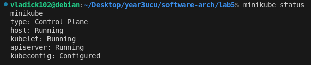

```bash
# 2. Build images inside Minikube's Docker daemon
chmod +x build.sh deploy.sh teardown.sh
./build.sh

# 3. Apply all manifests
./deploy.sh
```

All pods reach `Running` state:

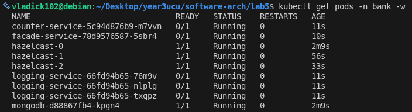

```bash
# 4. Get the external URL
minikube service facade-service -n bank --url
# → http://192.168.49.2:30080  (or similar)
```

---

## Service Registry & Discovery (Requirements 1 & 2)

In Kubernetes, every `Service` object acts as the registry entry for its pods. The facade discovers `logging-service` and `counter-service` purely by DNS name — no hardcoded IPs, no custom discovery server.

```bash
kubectl get services -n bank
kubectl get endpoints -n bank
```

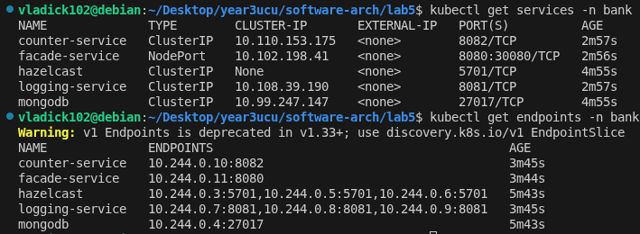

The `endpoints` output shows the individual pod IPs behind the `logging-service` ClusterIP — these are what the facade resolves when it calls `http://logging-service.bank.svc.cluster.local:8081`.

---

## Config Store (Requirements 3 & 4)

Hazelcast cluster members and the message queue name are stored in a **ConfigMap** and injected into each pod as environment variables — no hardcoded values in any service's code or Dockerfile.

```bash
kubectl get configmap app-config -n bank -o yaml
```

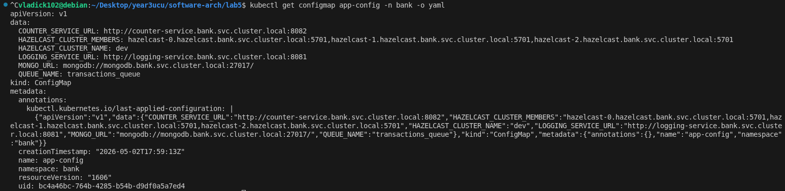

---

## Testing

### 1. Asynchronous Transactions

Sending 10 `POST /transaction` requests. The facade immediately enqueues each one into the Hazelcast Distributed Queue and returns `balance: null` — processing is fully asynchronous.

```bash
URL=http://$(minikube ip):30080

for i in $(seq 1 10); do
  curl -s -X POST $URL/transaction \
       -H "Content-Type: application/json" \
       -d '{"user_id": "alice", "amount": 10}' | python3 -m json.tool
done
```

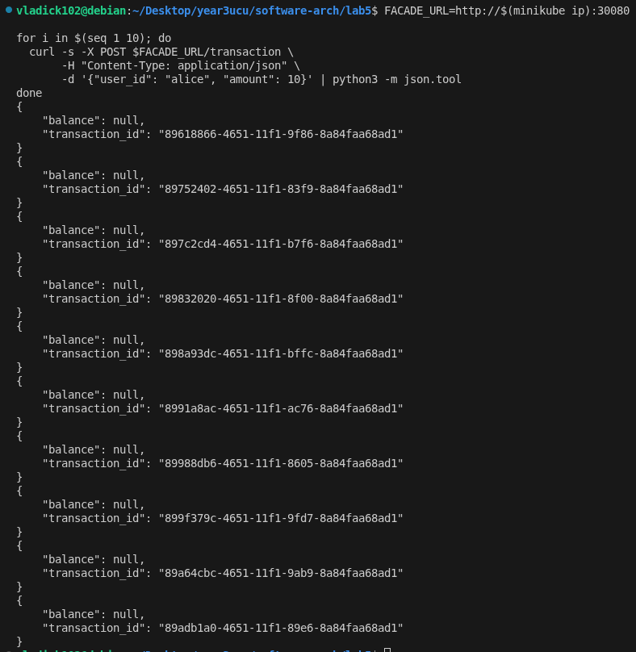

### 2. Reading Results

Once the counter-service background thread drains the queue, balances are persisted in MongoDB and available via synchronous GET requests.

```bash
curl -s $URL/accounts | python3 -m json.tool
```

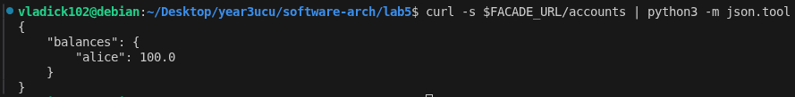

```bash
curl -s $URL/user/alice | python3 -m json.tool
```

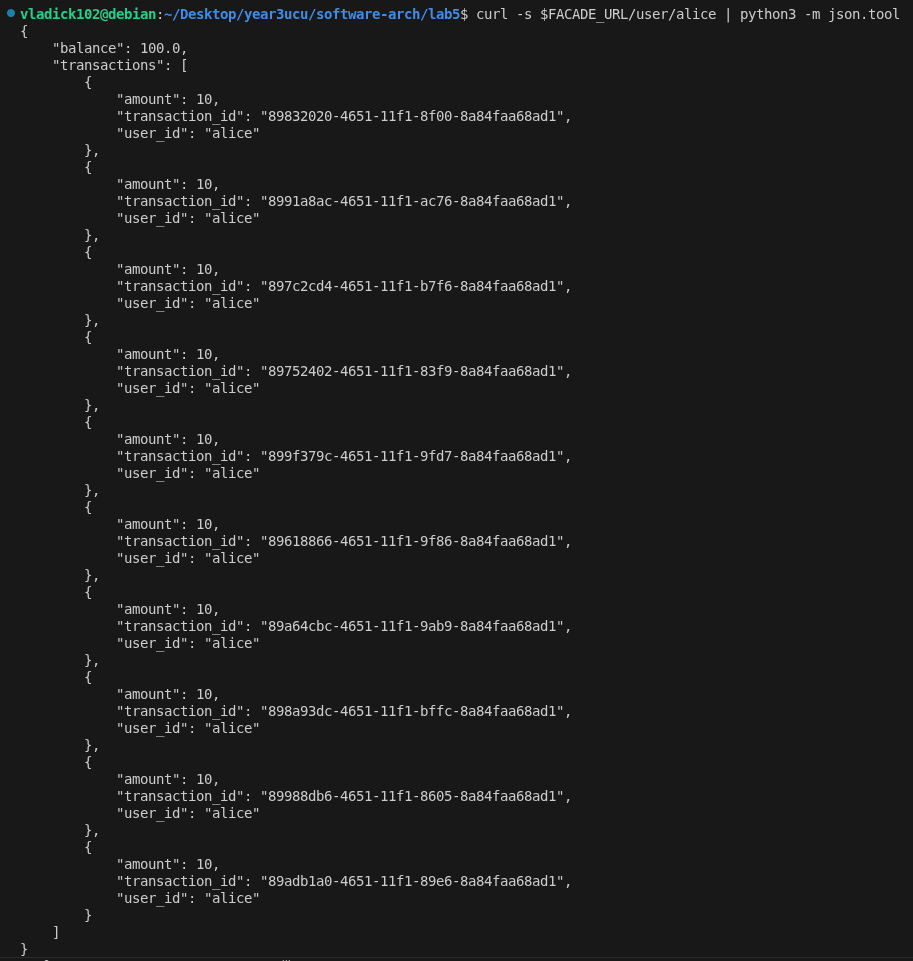

---

## Fault Tolerance (Requirement 5)

Deleting a pod is immediately reflected in Kubernetes — the pod disappears from the endpoint list and the facade stops routing to it. The remaining healthy pods absorb all traffic without any code-level changes.

```bash
# Delete one logging-service pod
kubectl delete pod -n bank $(kubectl get pods -n bank -l app=logging-service -o name | head -1)

# Watch status — deleted pod shows Terminating, replacement starts
kubectl get pods -n bank -l app=logging-service
```

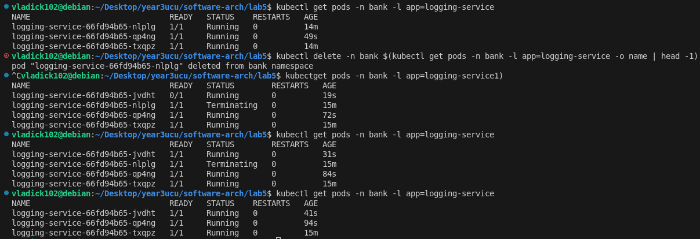

Requests continue to succeed while the pod is gone, routed to the remaining two instances:

```bash
for i in $(seq 1 10); do
  curl -s -X POST $URL/transaction \
       -H "Content-Type: application/json" \
       -d '{"user_id": "alice", "amount": 10}' | python3 -m json.tool
done
```

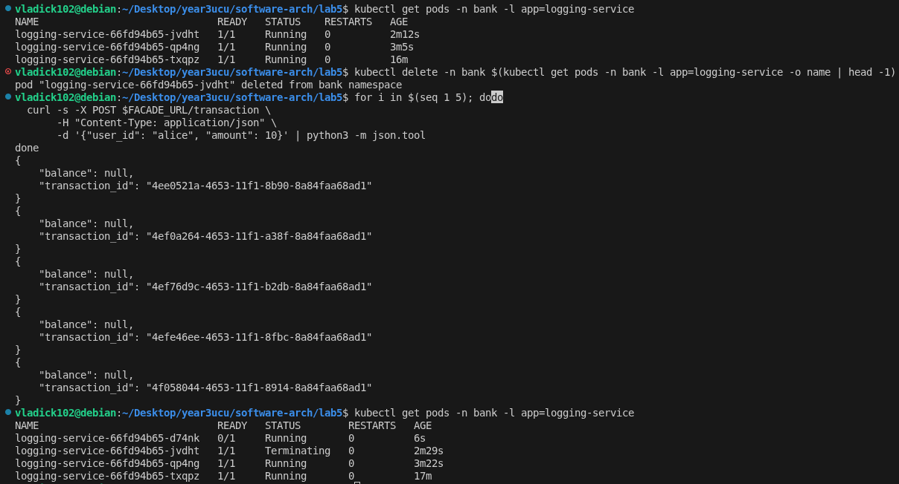

Kubernetes automatically starts a replacement pod and adds it back to the endpoint list once its readiness probe passes — no manual intervention required.

---

## Scaling

Kubernetes allows scaling replicas up or down with a single command, unlike Lab 4 where each instance was a separately named container.

```bash
# Scale down to 1
kubectl scale deployment logging-service -n bank --replicas=1
kubectl get pods -n bank -l app=logging-service

# Scale back to 3
kubectl scale deployment logging-service -n bank --replicas=3
kubectl get pods -n bank -l app=logging-service
```

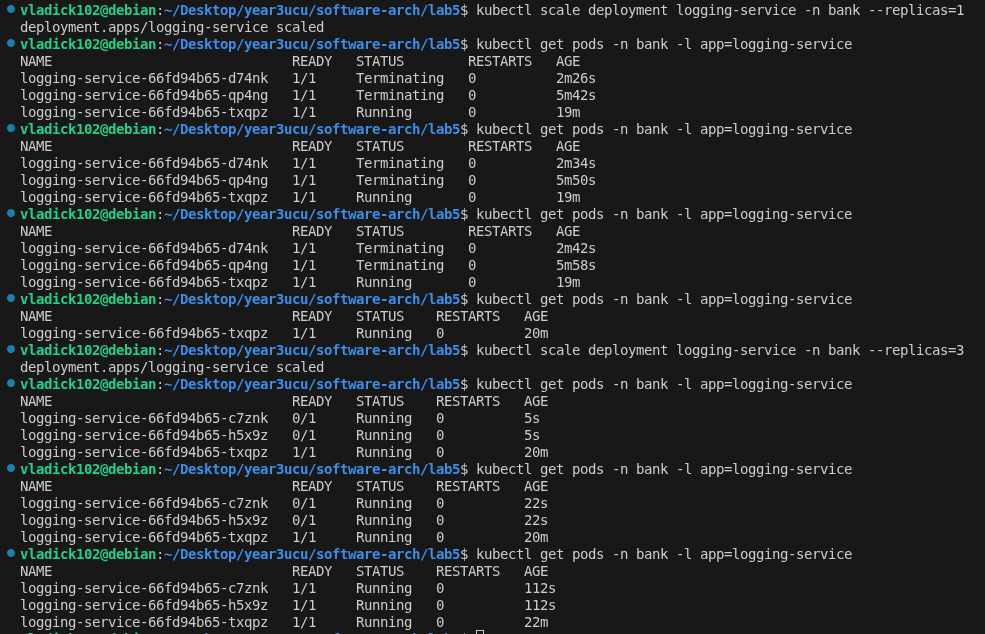

---

## Performance Test

```bash
python3 test_client.py --clients 10 --t 1000
```

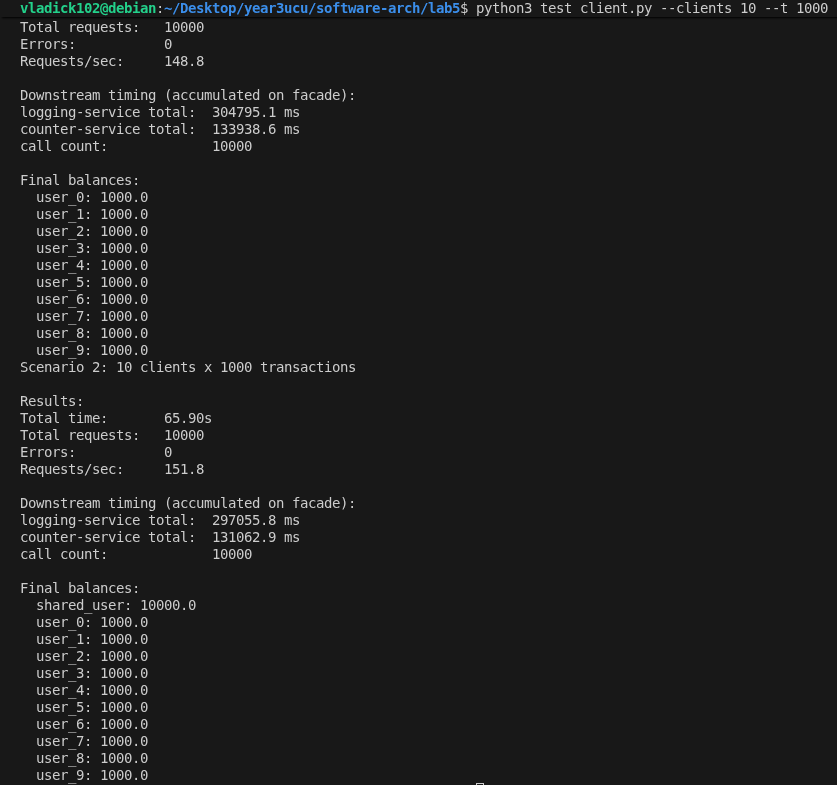

---

## Useful Commands

```bash
# All pods in the namespace
kubectl get pods -n bank

# Stream logs from all replicas of a deployment
kubectl logs -n bank -l app=logging-service --prefix=true -f

# Watch endpoint IPs for the logging-service load balancer
kubectl get endpoints logging-service -n bank -w

# Port-forward facade locally (alternative to NodePort)
kubectl port-forward -n bank service/facade-service 8080:8080

# Exec into a running pod
kubectl exec -it -n bank deployment/facade-service -- bash

# Tear down everything
./teardown.sh
```

---

## Comparison: Lab 4 vs Lab 5

| Aspect | Lab 4 (Docker Compose + custom config-server) | Lab 5 (Kubernetes) |
|---|---|---|
| Service Registry | Custom Flask app | Built into K8s (etcd + kube-apiserver) |
| Service Discovery | HTTP call to `/services/<name>` | kube-dns (`service-name.namespace.svc.cluster.local`) |
| Config Store | Docker `environment:` vars | ConfigMap (editable without rebuild) |
| Load Balancing | Random shuffle in facade code | kube-proxy (iptables/ipvs) — transparent |
| Health Checks | None | Readiness + Liveness probes |
| Fault Detection | None | Pod removed from endpoints on failed probe |
| Scaling | Named containers (`logging-service-1/2/3`) | `kubectl scale deployment ...` |
| `python-consul` | Required | **Not needed** |