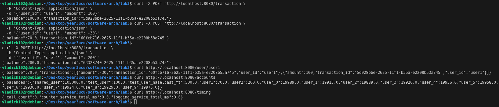
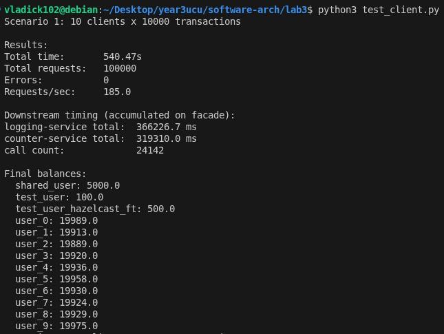
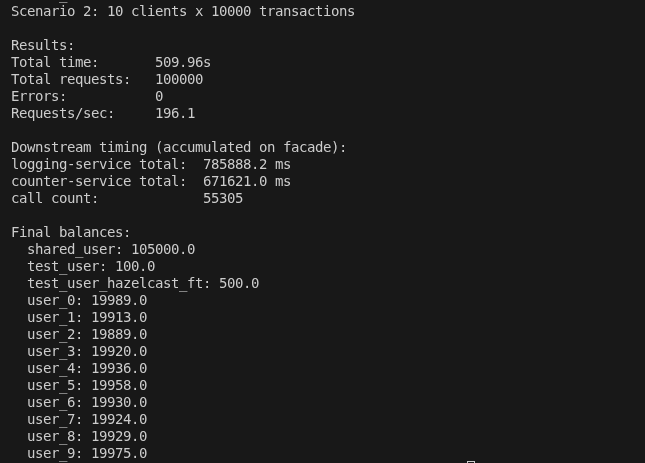

# Microservices with Hazelcast Distributed Map and Database (Lab 3)

This is the continuation of the basic microservices architecture, now having load balancing, a distributed cache via Hazelcast, and persistent database storage via MongoDB.

## Architecture

The updated system consists of the following components:

- Facade Service (Port 8080) - Main entry point that coordinates requests and implements random-routed load balancing to the multiple instances of the Logging Service. 
- Logging Service (Port 8081) - 3 instances running in parallel. Instead of local memory, it uses a Hazelcast In-Memory Distributed Map to properly sync logs across nodes.
- Counter Service (Port 8082) - Manages request counters. Replaced the in-memory dictionary with MongoDB, using atomic updates (`$inc`) for balance aggregation.
- Hazelcast Cluster - 3 nodes providing the distributed map infrastructure.
- MongoDB - Disk-based persistent DB for the counter service.

All services are containerized and orchestrated with Docker Compose.

## Running the Application

Start all services:
```bash
docker-compose up --build -d
```

Test the basic functionality:
```bash
python3 test_client.py
```

Stop all services:
```bash
docker-compose down
```

## Testing

### Basic Functionality

Basic transactions and account lookups work seamlessly. Standard tests confirm the `facade-service` correctly routes transactions, and balances sum up appropriately using MongoDB atomicity.

### Scenario 1

Running 10 independent clients processing 10,000 requests each in parallel.

### Scenario 2

Running 10 concurrent clients processing 10,000 requests each under the same shared account.


## Analysis of the Results

### Scenario 1 (Independent Accounts)

The system successfully processed all 100,000 requests in **540.47 seconds**, achieving a rate of **185.0 requests per second**. The final balances accurately summed up, maintaining 10,000 operations without missing transactions. The downstream total times indicated that the logging-service operations took longer (366,226.7 ms total) than counter-service (319,310.0 ms).

*Comparison to Lab 1 (In-memory)*: The performance dropped from 246.6 RPS to 185.0 RPS, and time increased from ~405s to ~540s. 

### Scenario 2 (Shared Account)

Processing the 100,000 concurrent requests on a single account took **509.96 seconds**, resulting in a throughput of **196.1 requests per second**. The final balance for the shared account reached exactly `105000.0` (including original basic functionality tests), proving zero race conditions on the DB level. Downstream total time observed: 785,888.2 ms for logging-service and 671,621.0 ms for counter-service.

*Comparison to Lab 1 (In-memory)*: The RPS dropped from 237.7 RPS to 196.1 RPS, increasing time from 420s to 510s.

### Conclusion

As expected, there is a visible performance tradeoff. The throughput drop of ~20-25% from Lab 1 to Lab 3 illustrates the overhead costs introduced by distributed systems.