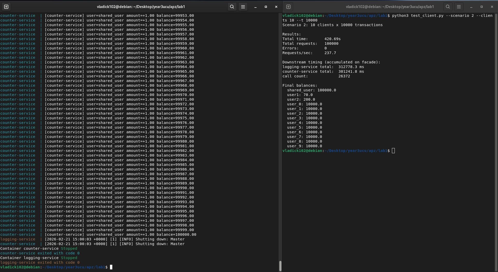

# Microservices Basics Lab

This project demonstrates a simple microservices architecture with three services communicating via HTTP.

## Architecture

The system consists of three services:

- Facade Service (Port 8080) - Main entry point that coordinates requests between services
- Logging Service (Port 8081) - Handles logging of operations
- Counter Service (Port 8082) - Manages request counters

All services are containerized using Docker and orchestrated with Docker Compose.

## Running the Application

Start all services:
```bash
docker-compose up --build
```

Test the basic functionality:
```bash
python test_client.py
```

Optional test arguments:
- `--scenario {1|2}` - Run specific scenario (default: run both)
- `--clients N` - Number of concurrent clients (default: 10)
- `--t N` - Transactions per client (default: 10000)

Example:
```bash
python test_client.py --scenario 1 --clients 5 --t 5000
```

Stop all services:
```bash
docker-compose down
```

## Testing

### Basic Functionality


### Scenario 1


### Scenario 2


